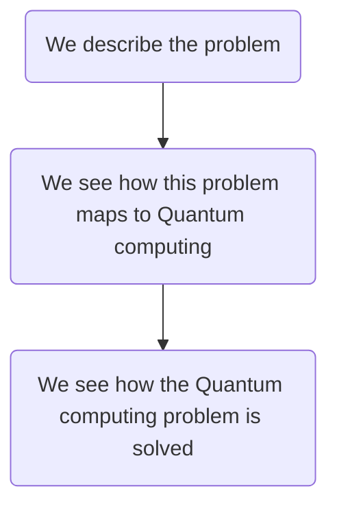
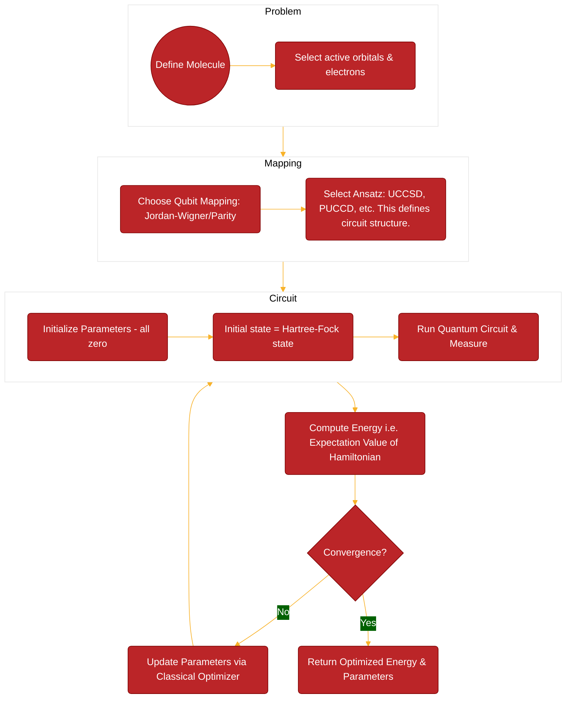

# test






```{mermaid}
:align: center
%%{
    init: {
        'theme': 'base',
        'themeVariables': {
        'primaryColor': '#BB2528',
        'primaryTextColor': '#fff',
        'primaryBorderColor': '#7C0000',
        'lineColor': '#F8B229',
        'secondaryColor': '#006100',
        'tertiaryColor': '#fff'
        }
    }}%%
graph TD
subgraph Problem
direction LR;
    A((Define Molecule))
    A --> B(Select active orbitals & electrons)
end
    
subgraph Mapping
direction LR;
    C(Choose Qubit Mapping: Jordan-Wigner/Parity)
    C --> D(Select Ansatz: UCCSD, PUCCD, etc. This defines circuit structure.)
end
    Problem --> Mapping
    
subgraph Circuit
direction LR;
    E(Initialize Parameters - all zero)
    E --> F(Initial state = Hartree-Fock state)
    F --> G(Run Quantum Circuit & Measure)
end
    Mapping --> Circuit
    
    Circuit --> H(Compute Energy i.e. Expectation Value of Hamiltonian)
    H --> I{Convergence?}
    I -- No --> J(Update Parameters via Classical Optimizer) --> Circuit
    I -- Yes --> K(Return Optimized Energy & Parameters);
```

```{mermaid}
:align: center

flowchart TD
    A(We describe the problem)
    B(We see how this problem maps to Quantum computing)
    C(We see how the Quantum computing problem is solved)
    A --> B --> C
```
